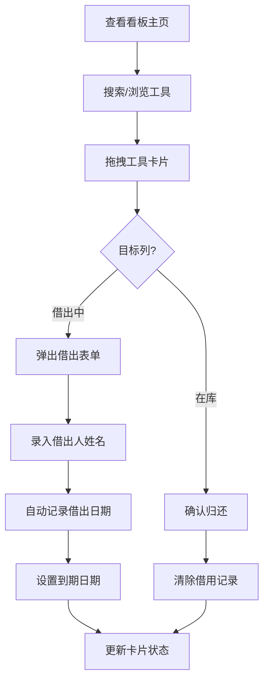

## 1. 产品概述
社区工具图书馆借还记录板，一个看板管理界面，帮助馆员高效管理电钻、割草机、梯子等社区共享工具的借还状态。
- 目标用户：社区图书馆馆员、工具管理员
- 核心价值：通过可视化看板和拖拽操作，简化工具借还流程，提升管理效率

## 2. 核心功能

### 2.1 用户角色
| 角色 | 注册方式 | 核心权限 |
|------|----------|----------|
| 馆员 | 系统预设 | 查看工具状态、拖拽切换借还状态、记录借出人信息、搜索工具 |

### 2.2 功能模块
1. **看板主页**：工具状态看板、搜索栏、统计信息
2. **工具卡片**：工具信息展示、状态标签、借出人信息、到期提醒
3. **借出弹窗**：借出人姓名录入、借出日期自动记录、到期日期设置

### 2.3 页面详情
| 页面名称 | 模块名称 | 功能描述 |
|-----------|-------------|---------------------|
| 看板主页 | 搜索栏 | 支持按工具名称搜索过滤 |
| 看板主页 | 状态列 | 两列布局："在库"和"借出中"，支持拖拽卡片切换 |
| 看板主页 | 统计栏 | 显示在库数量、借出数量、即将到期数量 |
| 工具卡片 | 工具信息 | 工具名称、图标/图片、编号 |
| 工具卡片 | 状态标签 | 显示当前状态，借出中显示借出人、借出日期、到期日期 |
| 工具卡片 | 到期提醒 | 到期前3天黄色预警，已过期红色警告 |
| 借出弹窗 | 表单 | 借出人姓名输入、自动记录借出日期、到期日期选择 |

## 3. 核心流程
馆员查看看板 → 搜索/浏览工具卡片 → 拖拽"在库"工具到"借出中"列 → 弹出表单录入借出人信息 → 自动记录借出日期和到期日期 → 卡片状态更新并显示借用人信息。归还时拖拽"借出中"卡片到"在库"列，自动清除借用记录。

## 4. 用户界面设计

### 4.1 设计风格
- **主色调**：暖木色（#8B5A2B）作为主色，搭配深绿色（#2D5A3D）作为状态色，营造社区工具房的自然质朴氛围
- **辅助色**：在库状态使用翠绿色（#4CAF50），借出中使用蓝色（#2196F3），到期预警黄色（#FF9800），过期警告红色（#F44336）
- **按钮风格**：圆角矩形，微阴影，悬浮时轻微上浮效果
- **字体**：标题使用粗体有衬线字体（Lora），正文使用清晰易读的无衬线字体（Noto Sans SC）
- **布局风格**：卡片式看板布局，两列等宽，卡片带拖拽手柄
- **图标风格**：使用Lucide图标库，工具类图标配对应emoji增强识别度

### 4.2 页面设计概览
| 页面名称 | 模块名称 | UI元素 |
|-----------|-------------|-------------|
| 看板主页 | 顶部栏 | 标题、搜索框、统计数字徽章、暖木色背景 |
| 看板主页 | 在库列 | 绿色顶部标签、卡片容器、虚线边框拖拽区域 |
| 看板主页 | 借出中列 | 蓝色顶部标签、卡片容器、虚线边框拖拽区域 |
| 工具卡片 | 在库卡片 | 绿色左边框、工具图标、名称、编号、"可借出"标签 |
| 工具卡片 | 借出卡片 | 蓝色左边框、借用人头像占位、借出日期、到期日期、到期变色提示 |
| 借出弹窗 | 表单 | 毛玻璃背景、圆角、姓名输入框、日期选择器、确认/取消按钮 |

### 4.3 响应式
桌面优先设计，两列并排布局；平板及移动端自动切换为单列上下布局，拖拽改为点击切换状态。支持触摸设备滑动操作。
