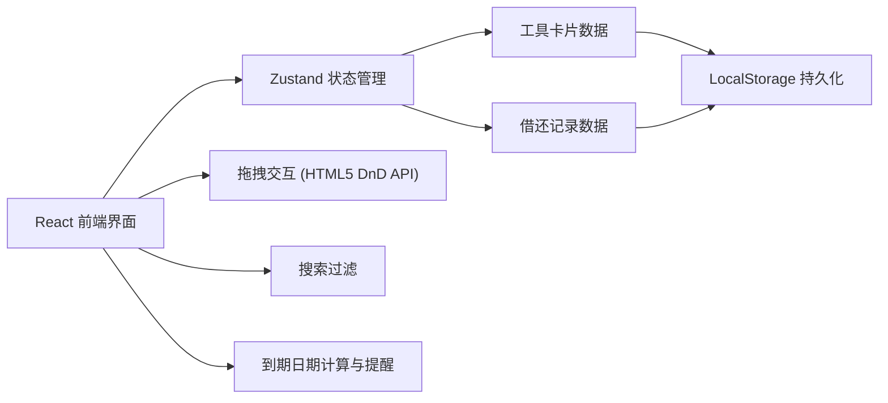
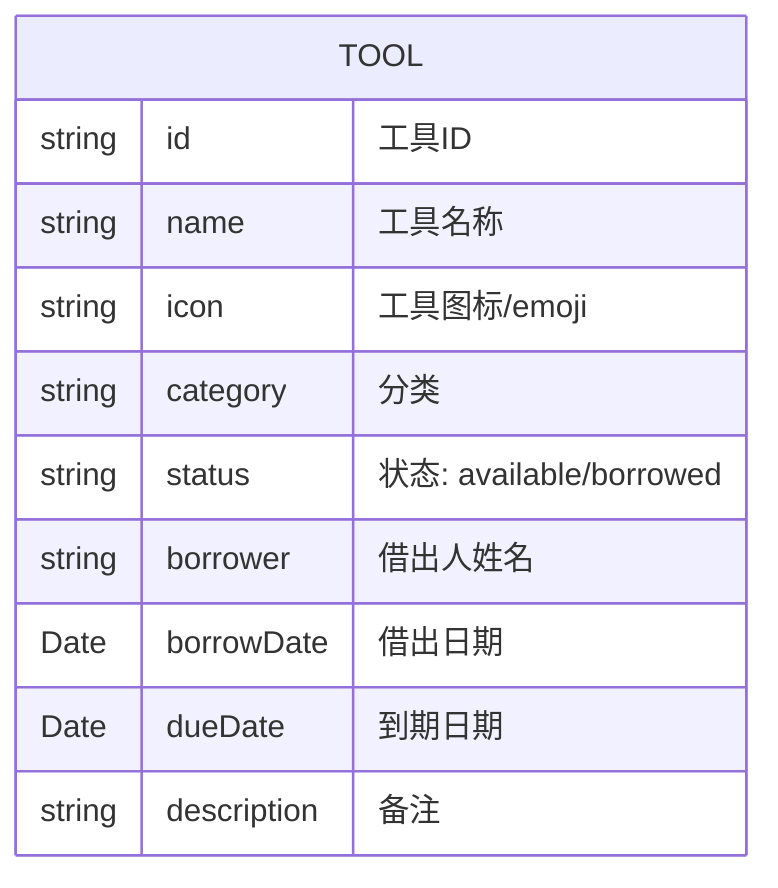

## 1. 架构设计



## 2. 技术描述
- **前端**：React@18 + TypeScript + Vite + Tailwind CSS@3
- **状态管理**：Zustand
- **图标**：lucide-react
- **拖拽**：原生 HTML5 Drag and Drop API
- **数据持久化**：LocalStorage（模拟数据存储）
- **初始化工具**：vite-init

## 3. 路由定义
| 路由 | 用途 |
|-------|---------|
| / | 工具借还看板主页 |

## 4. 数据模型

### 4.1 数据模型定义



### 4.2 TypeScript 类型定义

```typescript
type ToolStatus = 'available' | 'borrowed';

interface Tool {
  id: string;
  name: string;
  icon: string;
  category: string;
  status: ToolStatus;
  borrower?: string;
  borrowDate?: string;
  dueDate?: string;
  description?: string;
}

interface ToolStore {
  tools: Tool[];
  searchQuery: string;
  setSearchQuery: (query: string) => void;
  borrowTool: (id: string, borrower: string, dueDate: string) => void;
  returnTool: (id: string) => void;
  moveTool: (id: string, targetStatus: ToolStatus, borrower?: string, dueDate?: string) => void;
  filteredTools: Tool[];
  stats: { available: number; borrowed: number; dueSoon: number; overdue: number };
}
```

### 4.3 初始模拟数据

```typescript
const initialTools: Tool[] = [
  { id: '1', name: '电钻', icon: '🔧', category: '电动工具', status: 'available' },
  { id: '2', name: '割草机', icon: '🌿', category: '园艺工具', status: 'available' },
  { id: '3', name: '梯子', icon: '🪜', category: '登高设备', status: 'borrowed', borrower: '张三', borrowDate: '2026-06-01', dueDate: '2026-06-10' },
  { id: '4', name: '扳手套装', icon: '🔩', category: '手动工具', status: 'available' },
  { id: '5', name: '手推车', icon: '🛒', category: '运输设备', status: 'borrowed', borrower: '李四', borrowDate: '2026-06-05', dueDate: '2026-06-15' },
  { id: '6', name: '电锯', icon: '🪚', category: '电动工具', status: 'available' },
  { id: '7', name: '高压水枪', icon: '💧', category: '清洁设备', status: 'available' },
  { id: '8', name: '锤子', icon: '🔨', category: '手动工具', status: 'borrowed', borrower: '王五', borrowDate: '2026-06-07', dueDate: '2026-06-09' },
];
```
